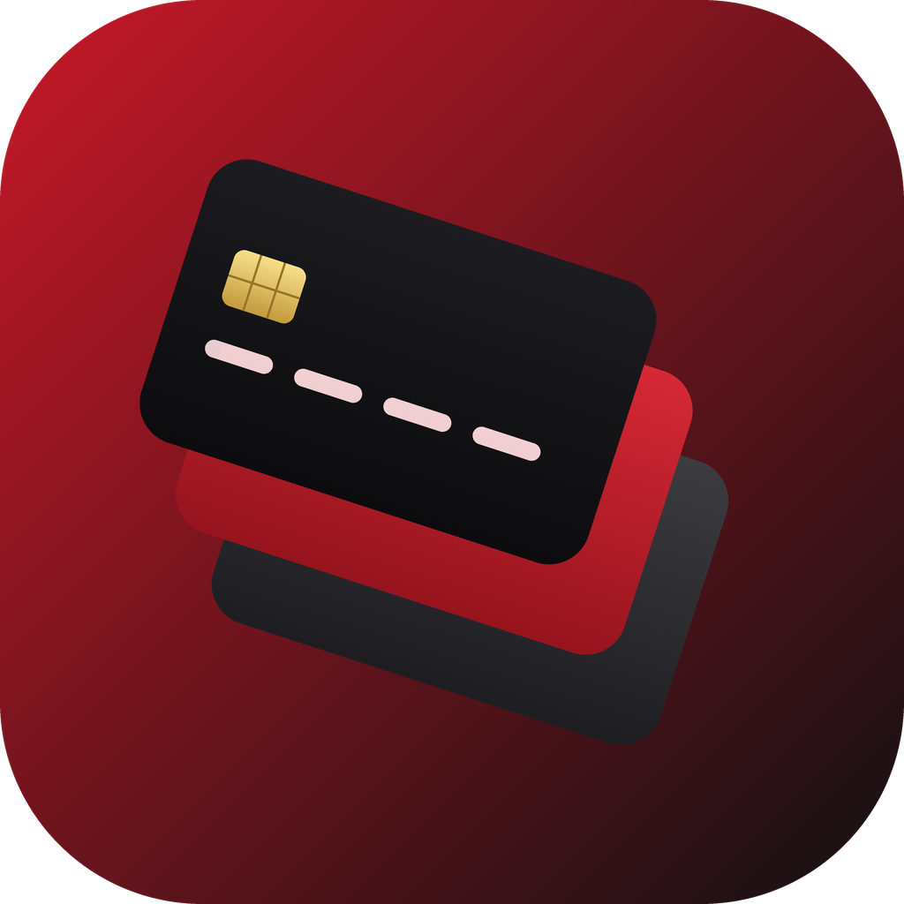
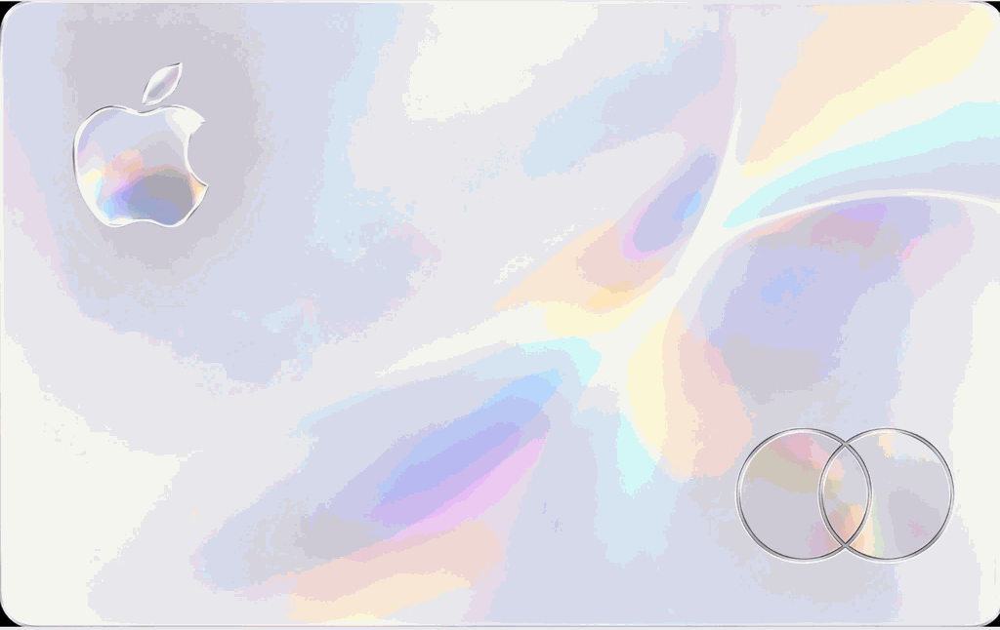
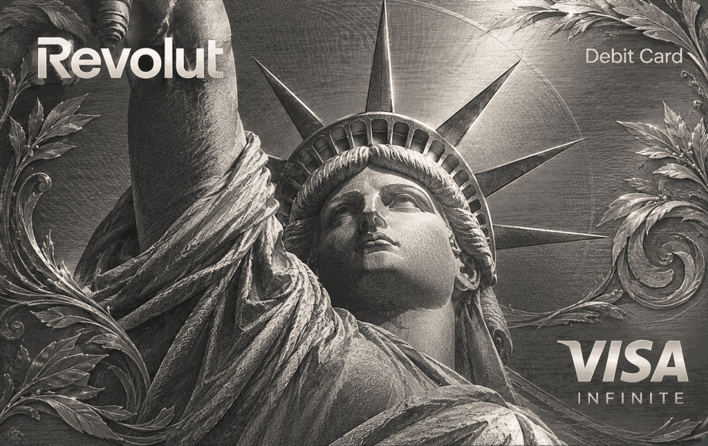
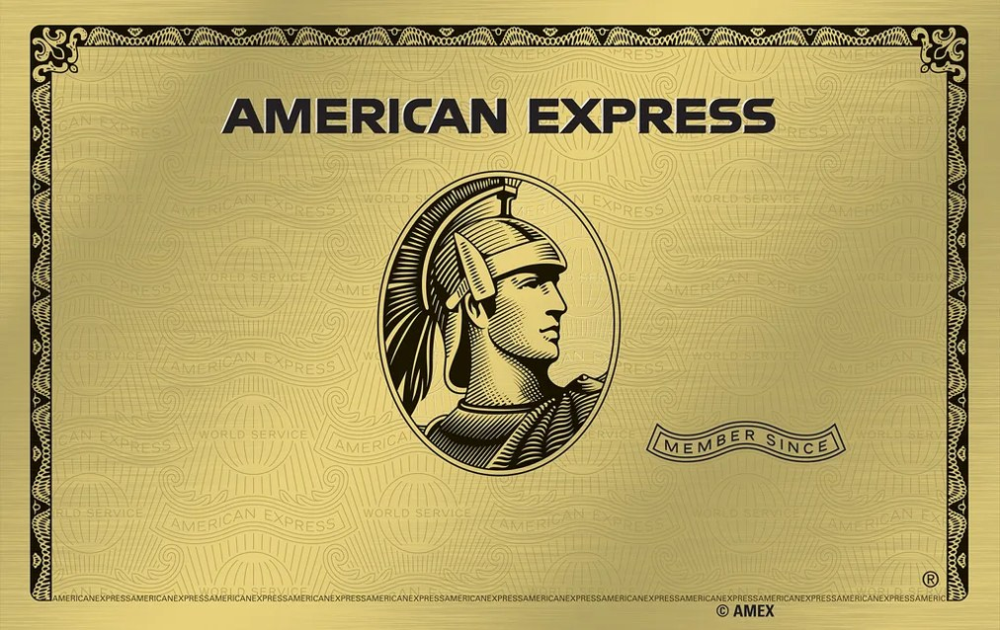
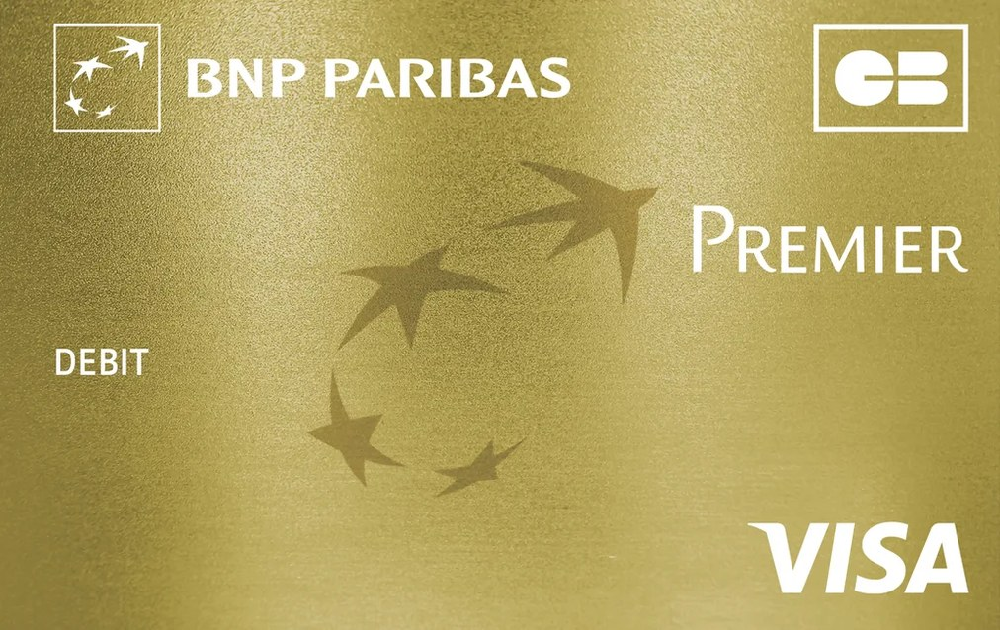

  

# Stash 2.0

> Portefeuille local sécurisé type Apple Wallet pour cartes de fidélité, cartes bancaires et titres d'accès sur iOS.

---

## Aperçu

Quelques-uns des designs de cartes intégrés à l'app.

  
  
  

  
  
  

---

## Nouveautés de la version 2.0.0

- **Accueil en pile de cartes Wallet** : Superposition fluide et compacte inspirée d'Apple Wallet, avec animations de ressort naturelles (`spring physics`), déploiement interactif et option de basculement vers la grille classique.
- **Galerie de 17 designs bancaires officiels intégrés** : Rendu haute fidélité (1024x646, 1.85 Mo optimisé) pour Visa, Mastercard, American Express, banques françaises et internationales, avec sélecteur visuel par catégories.
- **Scanner caméra VisionKit & OCR local** : Reconnaissance instantanée sur l'appareil des codes-barres de fidélité et des cartes bancaires (numéro avec contrôle de Luhn et date d'expiration).
- **Formats de codes-barres étendus** : Prise en charge native de QR Code, Code 128, EAN-13, EAN-8, UPC-A, PDF417 et Aztec avec résolution automatique du format et vérification des clés de contrôle.
- **Sauvegarde complète chiffrée (.stashbackup)** : Protection de bout en bout de toutes les cartes et numéros secrets du trousseau via chiffrement AES-256-GCM et dérivation de clé PBKDF2 (600 000 itérations HMAC-SHA256).
- **Sauvegarde automatique locale** : Sauvegarde silencieuse en temps réel dans un dossier choisi par l'utilisateur (Fichiers ou iCloud Drive) via signets d'accès sécurisés (`security-scoped bookmarks`).
- **Organisation & Favoris** : Épinglage des cartes favorites, tri multicritère (alphabétique, récent, date d'ajout, manuel) et filtres par catégories.
- **Rappels d'expiration locaux** : Notifications système programmées 30 jours avant et au début du mois d'expiration des cartes bancaires.
- **Mode présentation caisse plein écran** : Pousse la luminosité de l'écran à 100 %, verrouille la mise en veille automatique (`isIdleTimerDisabled`), permet la rotation du code pour faciliter le scan laser des caisses en magasin.
- **App Intents, Siri & Spotlight** : Raccourcis iOS pour ouvrir une carte à la voix ou via le bouton Action. Indexation Spotlight optionnelle pour les cartes de fidélité (les cartes bancaires sont strictement exclues de Spotlight).
- **Sécurité & Confidentialité renforcées** : Accès biométrique Face ID / Touch ID avec code de secours de l'appareil, bouclier de confidentialité multitâche, quarantaine automatique en cas de fichier altéré.

---

## Architecture de sécurité

1. **Zéro serveur distant** : Aucune donnée ne quitte jamais l'appareil. Aucune connexion réseau requise, aucun tracker, aucune télémétrie.
2. **Isolation trousseau (Keychain)** : Les numéros complets de cartes bancaires sont conservés dans le Keychain avec les politiques d'accès `kSecAccessControlBiometryCurrentSet` et code de secours de l'iPhone.
3. **Chiffrement des sauvegardes** : L'archive `.stashbackup` utilise AES-256-GCM et un sel cryptographique aléatoire de 16 octets dérivé avec 600 000 itérations PBKDF2-SHA256 (recommandations OWASP).

---

## Installation

### Via Feather / AltStore / Sideloadly (Certificat personnel)
1. Télécharger l'archive IPA unsigned générée par le workflow GitHub Actions (`Artifacts` > `Stash-unsigned-ipa`).
2. Importer le fichier `.ipa` dans **Feather** (ou AltStore / Sideloadly) avec votre certificat de signature.
3. Installer l'application sur votre iPhone.

---

## Développement et Tests

### Prérequis
- **macOS** 15+ (Sequoia)
- **Xcode 26+** (SDK iOS 26.0+)
- **Swift 5+** / Swift Testing

### Lancer les tests unitaires
~~~bash
xcodebuild test \
  -project Stash.xcodeproj \
  -scheme Stash \
  -destination 'platform=iOS Simulator,name=iPhone 16 Pro'
~~~

---

## Licence
Application développée pour un usage personnel et sécurisé.